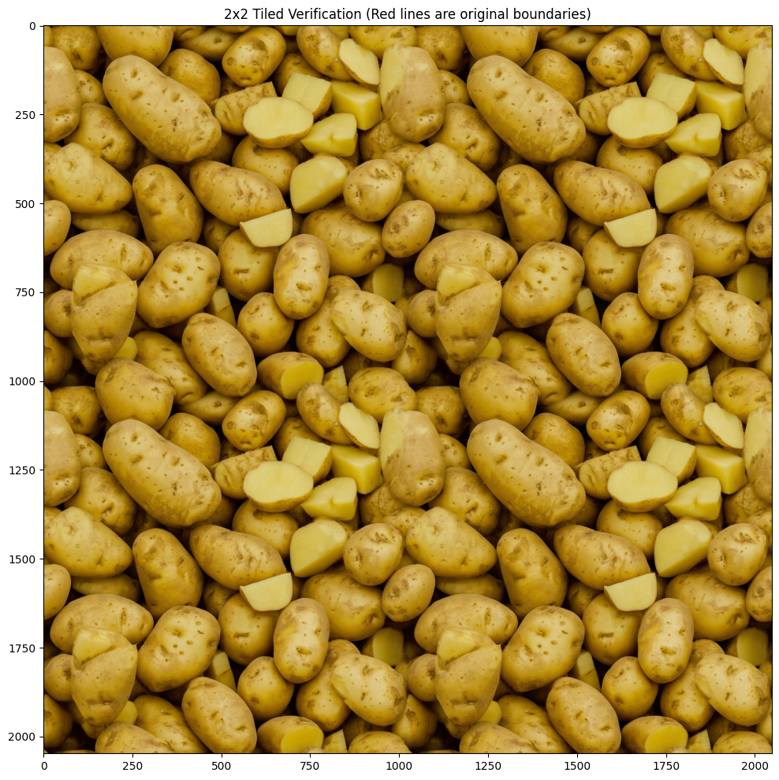

# Z-Image-Seamless-Tiler
A Python script for generating seamless, tileable textures with Z-Image using Noise Rolling and Circular VAE Padding.

## 效果对比 | Comparison

| Z-Image 默认生成 (Original) | Seamless 优化生成 (Optimized) |
| :---: | :---: |
|  |  |

---

## 使用说明 (Chinese)

### 环境要求
本脚本需要在 [DiffSynth-Studio](https://github.com/modelscope/DiffSynth-Studio) 环境下运行。

### 安装与位置
请将 `z_image_tiling.py` 放置在 DiffSynth-Studio 项目的以下相对路径中：
`./examples/z_image/model_inference/`

---

## Usage Guide (English)

### Requirements
This script is designed to work within the [DiffSynth-Studio](https://github.com/modelscope/DiffSynth-Studio) environment.

### Installation & Placement
Please place `z_image_tiling.py` into the following relative path inside your DiffSynth-Studio directory:
`./examples/z_image/model_inference/`

---

## 主要特性 | Features
* **Noise Rolling**: 优化噪声分布，减少边界感。
* **Circular VAE Padding**: 解决 VAE 解码产生的接缝问题。
* **One-click Generation**: 简单集成，快速生成高质量无缝贴图。

---

## 路线图 | Roadmap

目前项目正在积极开发中，未来将支持更多模型：
The project is under active development. Support for more models is coming soon:

- [x] **Z-Image** (Current Support)
- [ ] **Qwen-Image** (To Do)
- [ ] **Flux2** (To Do)
- [ ] **ComfyUI Custom Nodes** (Upcoming 🚀) - 计划将该算法封装为 ComfyUI 插件节点。

---
